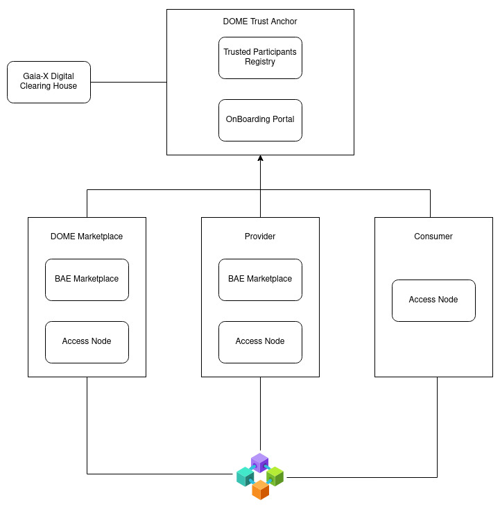
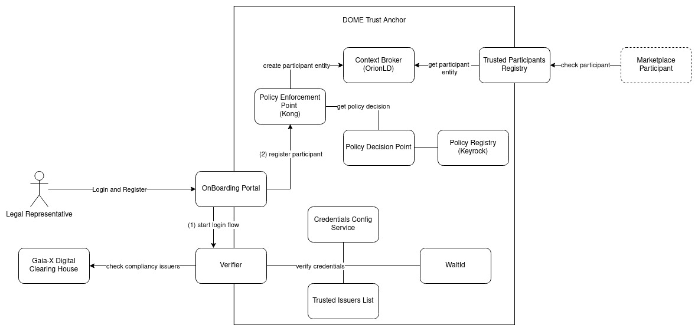
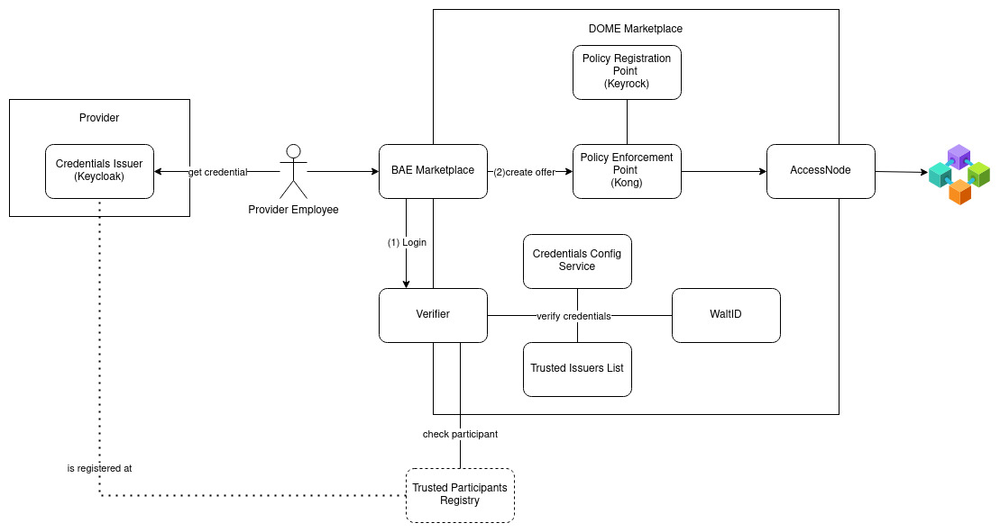
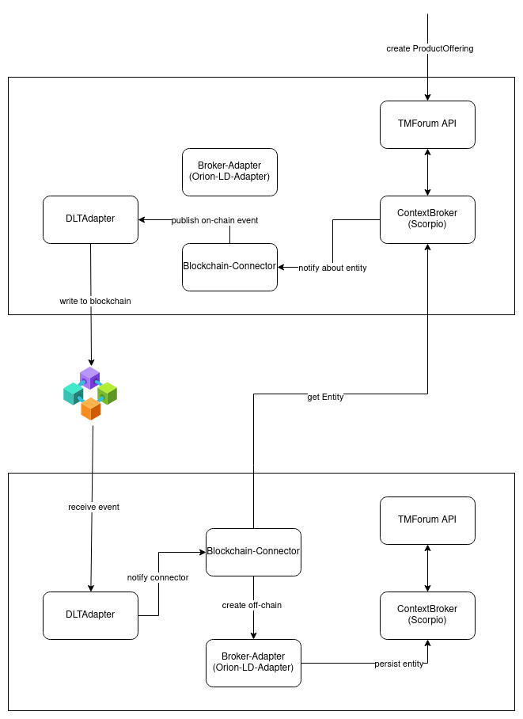

# Architecture

The following documentation describes the DOME Marketplace architecture. It shows the [currently deployed PoC](../ionos/) together with two demonstrational participants, deployed in a [FIWARE-hosted environment](https://github.com/FIWARE-Ops/fiware-gitops/tree/master/aws/dome).

## Top-Level View



As shown in the diagram, the PoC's decentralized Marketplace consists of 4 roles:

- the [DOME Trust Anchor](../ionos/dome-trust/)
- the [DOME Marketplace](../ionos/marketplace/)
- a [Provider Instance](https://github.com/FIWARE-Ops/fiware-gitops/tree/master/aws/dome/provider)
- a [Consumer Instance](https://github.com/FIWARE-Ops/fiware-gitops/tree/master/aws/dome/consumer)

DOME Marketplace, Provider and Consumer are actual participants of the DOME Marketplace. They are connected throught their instances of the [Access Node](#the-access-node) to mutually receive Marketplace entries, like Products and Offerings. The Trust-Relationship between them is built through the DOME Trust Anchor, where each instance can check contacting participants to be trusted in the DOME Marketplace.

## The DOME Trust Anchor



In order to ensure trust between the participants, a Trust Anchor is required. For the participants, it offers two essential features:

- the [Trusted Participants Registry](../ionos/dome-trust/trusted-issuers-registry/)(implementing the [EBSI Trusted Issuers Registry](https://api-pilot.ebsi.eu/docs/apis/trusted-issuers-registry/latest#/)), where participants can check if credentials are issued by a DOME Participant 
- the [OnBoarding Services](../ionos/dome-trust/portal/), where new participants can on-board themself to the DOME Marketplace


### Trusted Participants Registry

The Trusted Participants Registry is a an implementation of the [EBSI Trusted Issuers Registry](https://api-pilot.ebsi.eu/docs/apis/trusted-issuers-registry/latest#/), where participants can check if credentials issuers are valid participants. Its backed by a storage(as of know, an [NGSI-LD ContextBroker](https://github.com/FIWARE/catalogue#core-context-broker-components)) that contains information about the participants. 

### OnBoarding Services

To allow Self-OnBoarding, an OnBoarding-Portal is provided. The portal acts as a central entry-point for "Legal Representatives" of potential participants, to add a [Gaia-X compliant Self-Description](https://gaia-x.gitlab.io/policy-rules-committee/trust-framework/gaia-x_trust_framework/) to the list of trusted participants. In order to do so, the representative needs to provide 3 [Verifiable Credentials](https://www.w3.org/TR/vc-data-model/):
- a Self-Description[^1]
- a Compliancy Credential for the Self-Description[^2]
- a Natural Person Credential[^3](will be replaced in the future with "LEAR-Credential") for the user logging-in
> :bulb: A user should retrieve the credentials from its organisations issuer. See [credentials-issuance](#credential-issuance).

When opening the portal, the "Legal Representative" is asked to login with its wallet by scanning a QR-Code and presenting the three mentioned credentials. The [verifier](../ionos/dome-trust/verifier/) will then verify the chain of trust as following:

1. Verify the signature of all credentials.
2. Verfiy the validity of all credentials.
3. Verify that Compliancy Credential was issued by a Compliancy Issuer registered at the [Gaia-X Digital Clearing House](https://gaia-x.eu/gxdch/) [Compliancy Issuers Registry](https://registry.lab.gaia-x.eu/development/docs/#/ComplianceIssuers). 
4. Verfiy that the Compliancy Credential references the Self-Description(e.g. that the Self-Description is compliant).
5. Verify that the Natural Person Credential was issued by the Organisation described in the Self-Descripiton

The verifier will return a [JSON Web Token](https://jwt.io/), to be used by the portal for storing the Self-Description in the ContextBroker. To do so, the following happens:

1. Portal requests the [Policy Enforcement Point(PEP)](../ionos/dome-trust/kong/) in front of the [Context Broker](../ionos/dome-trust/orion-ld/)
2. PEP requests the [Policy Decision Point(PDP)](../ionos/dome-trust/pdp/) for a decision on the request
3. PDP checks the role in the JWT(e.g. "LEGAL_REPRESENTATIVE") with the Policies provided by the [Policy Registration Point(PRP)](../ionos/dome-trust/keyrock/)
4. Request is forwarded to the Context Broker and stored to be used by the Trusted Participants Registry


[^1]: Example self-description: 
    ```json
    {
        "type" : [ "VerifiableCredential" ],
        "@context" : [ "https://www.w3.org/2018/credentials/v1", "https://registry.lab.gaia-x.eu/development/api/trusted-shape-registry/v1/shapes/jsonld/trustframework#", "https://w3id.org/security/suites/jws-2020/v1" ],
        "id" : "urn:uuid:a4c51032-1aab-46ba-8f51-68210a60cc27",
        "issuer" : "did:web:provider.dome.fiware.dev",
        "issuanceDate" : "2023-04-26T09:17:52Z",
        "issued" : "2023-04-26T09:17:52Z",
        "validFrom" : "2023-04-26T09:17:52Z",
        "expirationDate" : "2023-04-28T21:17:52Z",
        "credentialSubject" : {
            "id" : "did:web:provider.dome.fiware.dev",
            "type" : "gx:LegalParticipant",
            "gx:legalName" : "DOME Provider",
            "gx:legalRegistrationNumber" : {
            "gx:vatID" : "MYVATID"
            },
            "gx:headquarterAddress" : {
            "gx:countrySubdivisionCode" : "BE-BRU"
            },
            "gx:legalAddress" : {
            "gx:countrySubdivisionCode" : "BE-BRU"
            },
            "gx-terms-and-conditions:gaiaxTermsAndConditions" : "70c1d713215f95191a11d38fe2341faed27d19e083917bc8732ca4fea4976700"
        },
        "proof" : {
            "type" : "JsonWebSignature2020",
            "creator" : "did:web:provider.dome.fiware.dev",
            "created" : "2023-04-26T09:17:52Z",
            "verificationMethod" : "did:web:provider.dome.fiware.dev#e1b0c827edd5446ebb830d9a8b9b748c",
            "jws" : "eyJiNjQiOmZhbHNlLCJjcml0IjpbImI2NCJdLCJhbGciOiJQUzI1NiJ9..SGj9KmaiowH2NOVJtWDN9tnAN4MivHJ2QdijCbTv-7V3ZXXtXrLI7qNkOMyxX9LwJv83S6USWFNoqWiluB8CiGYkfFe1FexqWBbodIIqxCM0xO7k2y78Zy_aMTjWkcFuKeGtELL6VeBnQglQauAOMOX60_-TRxNp96K8bJ-8O7EfJQhJnDVq5Dx6XE6oG4_vQyeDPafxb1_JmtjqG0aZ5b8ZRjPYkCYzpeomV4hAtOCT8xN7W6d7vAw07IeVZ_mcvk4OmS6hKND2x3g_gLfroTf43kx0sI-HeD6x4F3wCb_yFvxzolXZ4yI-f-JHalTwFuLJUKlrhNPsjse1eqRGCQ"
        }
    }
    ```

[^2]: Example Compliancy Credential:
    ```json
    {
        "@context": [
            "https://www.w3.org/2018/credentials/v1",
            "http://gx-registry-development:3000/development/api/trusted-shape-registry/v1/shapes/jsonld/trustframework#"
        ],
        "type": [
            "VerifiableCredential"
        ],
        "id": "https://storage.gaia-x.eu/credential-offers/b3e0a068-4bf8-4796-932e-2fa83043e203",
        "issuer": "did:web:compliance.lab.gaia-x.eu:development",
        "issuanceDate": "2023-04-26T09:19:11.791Z",
        "expirationDate": "2023-07-25T09:19:11.791Z",
        "credentialSubject": [
            {
            "type": "gx:compliance",
            "id": "did:web:raw.githubusercontent.com:egavard:payload-sign:master",
            "integrity": "sha256-9fc56e0099742e57d467156c4526ba723981b2e91eb0ccf6b725ec65b968fcc8"
            }
        ],
        "proof": {
            "type": "JsonWebSignature2020",
            "created": "2023-04-26T09:19:12.415Z",
            "proofPurpose": "assertionMethod",
            "jws": "eyJhbGciOiJQUzI1NiIsImI2NCI6ZmFsc2UsImNyaXQiOlsiYjY0Il19..bSsi9yohByC9021w1AiLvzgIozgYqTAWLBkEWC8Qay043k81p6UzWfZ04rFv48agxkzDHwCxlFGO_N24SLJvHieZwRJnyoM-VfIYfSJ-9iTI07TMQl-wd03sO5x4R8YWIDeSd3hoWkn5csmQYhQlXmwLRKpMni0qgMMmMTR336XkSImq5NpEiB8QzwJVkmjn4oHHELwEPa3HSfAl42lTUvAwQceaNU288QrPC0ykRW4mdPmKk5TXgkf19tolj8xwhr-pncVv_0D7LH3bYoFzzvNBeQQZ3LOT5tr9QD6AjIJN126gX1ia6gMdmj5SKT_7KgtWk9npsKg3hggpbnihBA",
            "verificationMethod": "did:web:compliance.lab.gaia-x.eu:development"
        }
    }
    ```

[^3]: Natural Person Credential: 
    ```json
    {
        "type" : [ "VerifiableCredential", "NaturalPersonCredential" ],
        "@context" : [ "https://www.w3.org/2018/credentials/v1", "https://w3id.org/security/suites/jws-2020/v1" ],
        "id" : "urn:uuid:2eff859a-1474-4e51-a897-0e1360fecff9",
        "issuer" : "did:web:provider.dome.fiware.dev",
        "issuanceDate" : "2023-04-26T09:41:32Z",
        "issued" : "2023-04-26T09:41:32Z",
        "validFrom" : "2023-04-26T09:41:32Z",
        "expirationDate" : "2023-04-28T21:41:32Z",
        "credentialSchema" : {
            "id" : "https://raw.githubusercontent.com/FIWARE-Ops/tech-x-challenge/main/schema.json",
            "type" : "FullJsonSchemaValidator2021"
        },
        "credentialSubject" : {
            "id" : "d7704c3f-4f13-474d-980c-6036ef670157",
            "type" : "gx:NaturalParticipant",
            "familyName" : "Legal",
            "firstName" : "Representative",
            "roles" : [ {
            "names" : [ "LEGAL_REPRESENTATIVE" ],
            "target" : "did:web:onboarding.dome-marketplace.org"
            } ],
            "email" : "legal-representative@dome-provider.org"
        },
        "proof" : {
            "type" : "JsonWebSignature2020",
            "creator" : "did:web:provider.dome.fiware.dev",
            "created" : "2023-04-26T09:41:32Z",
            "verificationMethod" : "did:web:provider.dome.fiware.dev#4057b20fdc4a4c25abaab4f44de95c0f",
            "jws" : "eyJiNjQiOmZhbHNlLCJjcml0IjpbImI2NCJdLCJhbGciOiJQUzI1NiJ9..Wm4S4chhXVYAibziWZ6HFUntav8xQz6iG9Lc-qyjnmeHeDrPvOnEMbKqQ1EmKzRhq1XHVl_yTEKo0T5F26ArbDokvaz-dK9LPa3PNkY8S-s5CAi5ufAIuO8FFqbCmonGr140U9_iLGYqaXEYpK9-AjmKl_-jB88jFlBxapbKEKGdHH1vrhggL_xbNmgbcRlueRgOWmHzy2RhFnzHxmpiCl6cvsHKB6dT-Q-VfBvwYExrJqGzLiGvxcNcqKnZ1OVEmaI7KPKQ8GBTvdp7P46gEVLlW_BQYdv3uDlHnoTZhz4ufJBLwMqiYrXvMmmscllnH_BUv2lUYXPRRBdSBD3EBA"
        }
    }
    ```

## The Marketplace Instance

All instances of the marketplace are structured the same. They consist of an Access Node and the BAE with its security framework. 




### Credential Issuance 

In order to log into a Marketplace Instance, the User needs to get a [Verifiable Credential](https://www.w3.org/TR/vc-data-model/) from its Organisation. 

The current instances of the Marketplace use [Keycloak](https://www.keycloak.org/) with the [Keycloak-VC-Issuer Plugin](https://github.com/FIWARE/keycloak-vc-issuer) as issuer. Therefor, the user will log into Keycloak(f.e. [Provider Keycloak](https://keycloak-provider.dome.fiware.dev/realms/dome/account/#/) - with username "provider-seller" and password "seller"), select the "NaturalPersonCredential ldp_vc" and scan the QR with its wallet(for demo-purposes, the [FIWARE Demo Wallet](https://demo-wallet.fiware.dev/)) could be used). 
The wallet now contains a verifiable credential, that holds the roles of the user, configured for each "siop2-client" in Keycloak. The Credential is signed with the key of the participant and therefor trusted by other DOME Participants.

For Onboarding an organization, the user requires a second credential from the Issuer. It contains the Self-Description, used for creating the trusted participant. In the [Provider Keycloak](https://keycloak-provider.dome.fiware.dev/realms/dome/account/#/), it could be retrieved as the "GaiaXParticipantCredential ldp_vc". This credential needs to prove its compliance at a Gaia-X Digital Clearing House' [Compliance Service](https://compliance.lab.gaia-x.eu/development/docs/#/Common/CommonController_issueVC). When using the FIWARE Demo Wallet, a button to request such credential at a preconfigured compliance service is available after the credential was received.

### Marketplace interaction

In order to create or buy on the marketplace, a user has to log into the market(f.e. https://dome-marketplace.org). When entering the market, a pop with a QR appears, that the user needs to scan with its wallet. After sending the Credential(as received in [Credentials Issuance](#credential-issuance)), the verifier will:

1. verify the signature and validity of the credential
2. verfiy that the issuer is a trusted participant in the DOME Marketplace
3. verfiy that the issuer is allowed to issue such credential and claims in the context of the current instance(at the Trusted Issuers List)
4. send a response with an Access-Token to the BAE

The BAE will then use the Access-Token to retrieve a JWT from the Verifier and use it for all interaction with the AccessNode. 
When creating an entry in the Marketplace, f.e. a Product Offering, the BAE will:

1. Send a request with the ProductOffering towards the Access Node, through the PEP, using the JWT
2. The PEP requests a descision at the PDP
3. PDP evaluates the role inside the JWT
4. PEP forwards the call to the Access Node

## The Access Node

To connect all Marketplace instances, a decentralized persistence layer is formed through the "AccessNodes". They provide a standardized interface to all Market-Implementations(like the BAE) in form of the [TMForum API](https://github.com/FIWARE/tmforum-api) and handle the distribution through all instances. 



When an entity(f.e. a ProductOffering) is created through the TMForum API, distribution through the Marketplace-Instances happens as following:

1. The TMForum API stores the entity in the [NGSI-LD format](https://www.etsi.org/deliver/etsi_gs/CIM/001_099/009/01.07.01_60/gs_CIM009v010701p.pdf) in its [Context Broker](../ionos/marketplace/scorpio/).
2. The Context Broker notifies the [Blockchain-Connector](../ionos/marketplace/connector/blockchain-connector-core/) about the entity.
3. The Blockchain-Connector generates a [Hash-Link](https://w3c-ccg.github.io/hashlink/) for the entity.
4. The Blockchain-Connector sends an event, containing the Hash-Link, to the [DLTAdapter](../ionos/marketplace/connector/dlt-adapter/)
5. The DLTAdapter creates a transaction on the Blockchain for the event, signed with the account of the participant.

Another instance will now receive the information about the new entity as following:
1. The DLTAdapter receives the event.
2. The DLTAdapter notifies the Blockchain-Connector with the event.
3. The Blockchain-Connector resolves the Hash-Link, retrieves the entity from its original location and compares the hashes.
4. If the Hash is equal, it sends the Entity to the Broker-Adapter, to be stored Off-Chain.
5. The Broker-Adapter persists the entity in the Context Broker, thus making it available for the TMForum-Instance of that AccessNode.
