# Demonstration

In order to demonstrate the capabilities of the DOME Marketplace, multiple participants are deployed:

- the [DOME Trust Anchor](../ionos/dome-trust/)
- the [DOME Marketplace](../ionos/marketplace/)
- a [Provider Instance](https://github.com/FIWARE-Ops/fiware-gitops/tree/master/aws/dome/provider)

For more details about the roles and components, see the [architecture-documentation](./ARCHITECTURE.md). A demo-scenario, show-casing some of the current features can be found under [demo](./DEMO.md)

## On Boarding

In order to become a participant in the DOME Marketplace, an organization has to OnBoard itself. For demonstration, the participant "DOME Provider", identified by the [DID](https://www.w3.org/TR/did-core/) "did:web:provider.dome.fiware.dev" is deployed in the [FIWARE Environment](https://github.com/FIWARE-Ops/fiware-gitops/tree/master/aws/dome/provider).

### Credentials Issuance

[As described](./ARCHITECTURE.md#onboarding-services), a user needs three credentials to do the OnBoarding process. They can be retrieved at the [Provider's Keycloak](https://keycloak-provider.dome.fiware.dev/realms/dome/account/#/) as following:

1. Navigate to the Keycloak Account Console and log in(for the demonstration, use username "provider-lear" and password "lear"):

2. Select the "Verifiable Credentials" section:
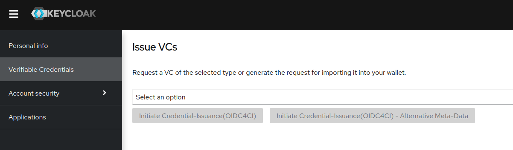
3. Open the [FIWARE Demo Wallet](https://demo-wallet.fiware.dev/) on your mobile phone:
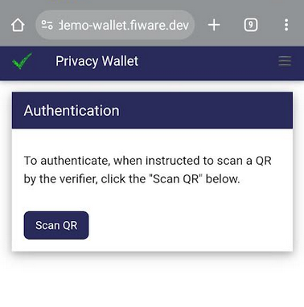
4. In Keycloak, select the "GaiaXParticipantCredential ldp_vc" and click on "Initiate Credential-Issuance(OIDC4CI)":
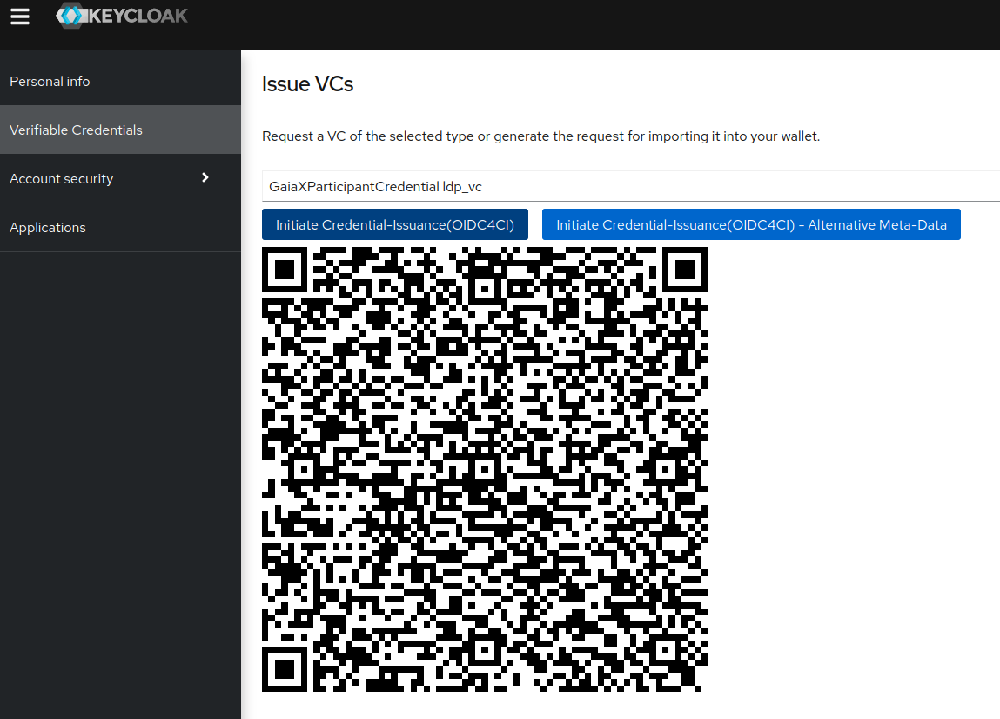
5. Scan the QR with the Mobile Phone(click on "Scan QR") and receive the VC(be aware: for security reasons, the QR is only valid for a couple of seconds. If the request fails, click on "Initiate Credential-Issuance(OIDC4CI)" again to start a new issuance process):
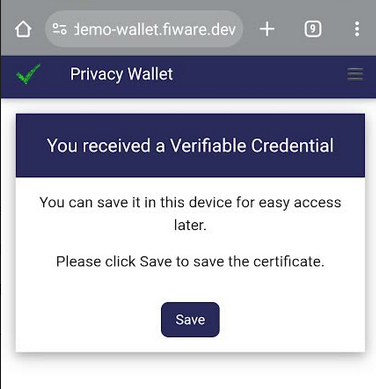
6. After clicking the "Save"-Button, the Credential is presented. To get a "Compliancy Credential" for the received VC, scroll down, select the "Get Compliancy Credential" button and click on the "FIWARE Compliance Service"(this is not an official Gaia-X Digital Clearing House, but an instance of it, [deployed by FIWARE](https://github.com/FIWARE-Ops/fiware-gitops/tree/master/aws/gaia-x/compliance-service) for Demo-Purposes). The compliancy credential will be shown:
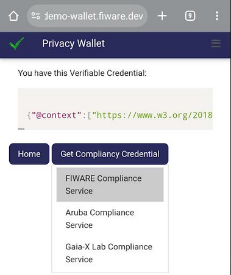
7. Click on the "Home" Button, you should now see 2 credentials in your wallet:
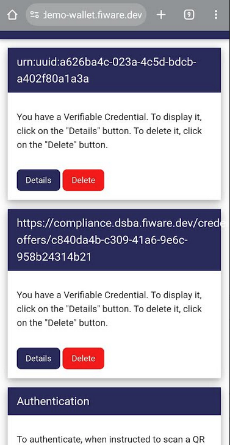
8. In order to get the missing third credential, move back to Keycloak and select the "NaturalPersonCredential ldp_vc" and initiate another issuance:
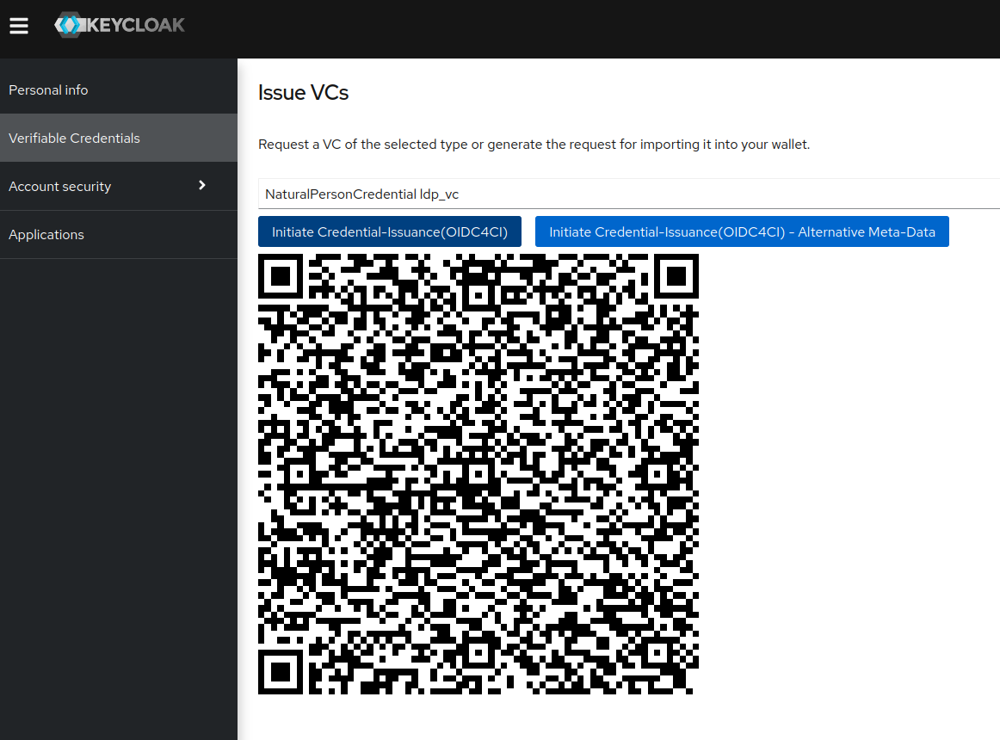
9. Click on "Scan QR" in the wallet again and retrieve the credential. Do NOT request a Compliancy Credential this time, just go back to home and see three credentials:
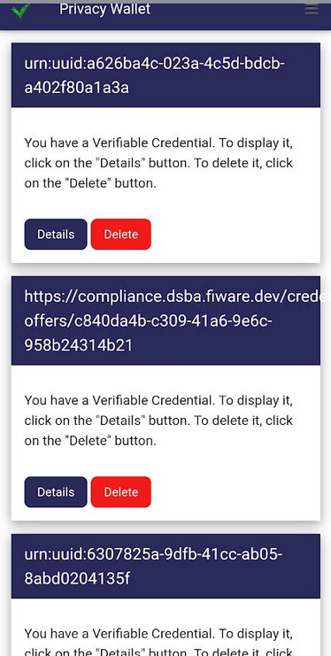

The credentials can now be used in the actual OnBoarding.

### Onboard at the portal

A demonstrational OnBoarding-Portal is available at https://onboarding-portal.dome-marketplace.org/. OnBoard your organisation with the following steps:

1. Go to the OnBoarding Portal:
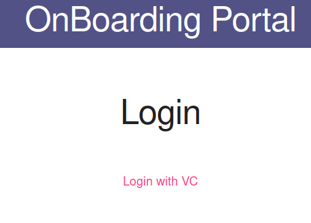
2. Click on the "Login with VC"-Link and allow the Pop-Up. A Pop-Up with the QR to initiate the Login-Process will show up:
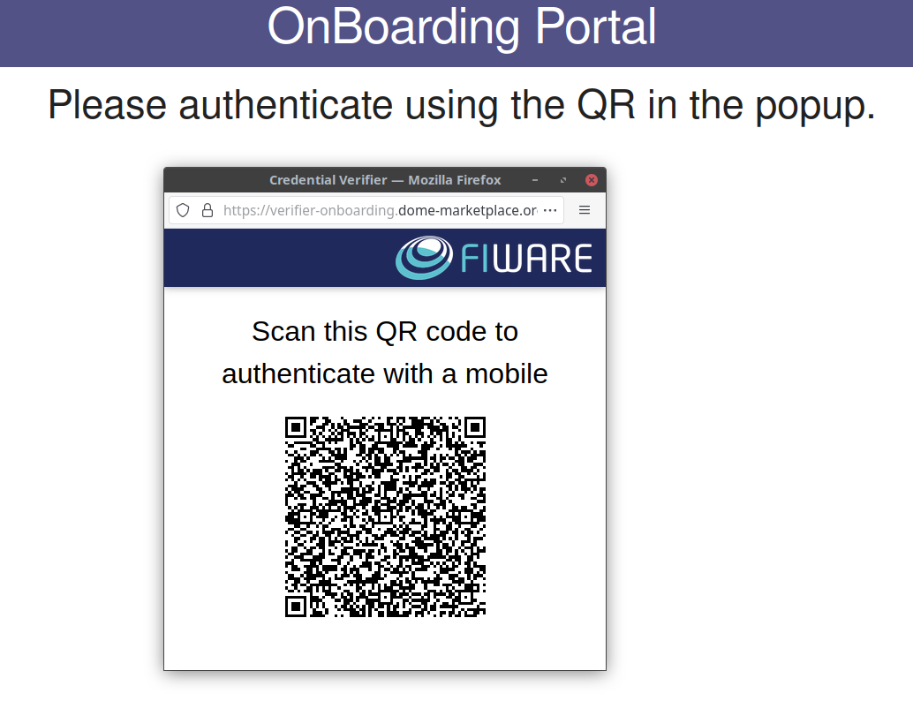
3. Use the wallet again to scan the QR-Code(click on the same "Scan QR" button) - be aware: the QR is only valid for 30s:
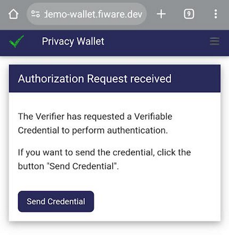
4. Click on the "Send Credential" button. All 3 credentials will now be sent to the OnBoarding-Portals verifier and you will automatically be forwarded to the portal:
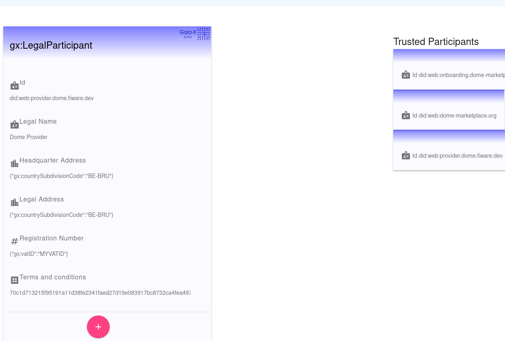

You are now logged-in to the portal as the legal-representative of "Dome Provider". On the left-side, the Self-Description provided is shown, on the right side all already registerd participants are listed. The pink "+" button on the bottom could be used to on-board the participant. This will not work for "Dome Provider" anymore, since its already onboarded.

## The Marketplace

The Marketplace instances are secured with the same framework as the OnBoarding-Portal. Therefor a Verifiable Credential is required again, that will be used to log into the Market.

### Issuance

Since the "Provider" is now a trusted participant of DOME, it can issue credentials to its users for logging into the Marketplace itself. To get such a credential:

1. Delete all previously received credentials from the Demo Wallet(more advanced wallets will allow to select the credentials to submit, but the Demo Wallet always sends all of them)
2. Log into the [Account Console of the Providers Keycloak](https://keycloak-provider.dome.fiware.dev/realms/dome/account/#/verifiable-credentials) again, this time using the user "provider-seller" with the password "seller". 
3. Get a "NaturalPersonCredential ldp_vc", as described in [Credentials Issuance](#credentials-issuance) step 8 and 9. The wallet should now contain a single credential:
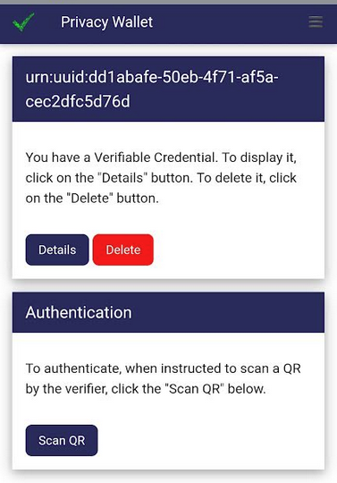

### Login

An instance of the [BAE Marketplace](../ionos/marketplace/bae/) is deployed for DOME. It is available at https://dome-marketplace.org. It can be used as following:

1. Navigate to the [Market](https://dome-marketplace.org):
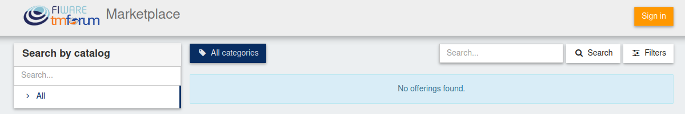
2. Click on "Sign in" and select "VC Login":
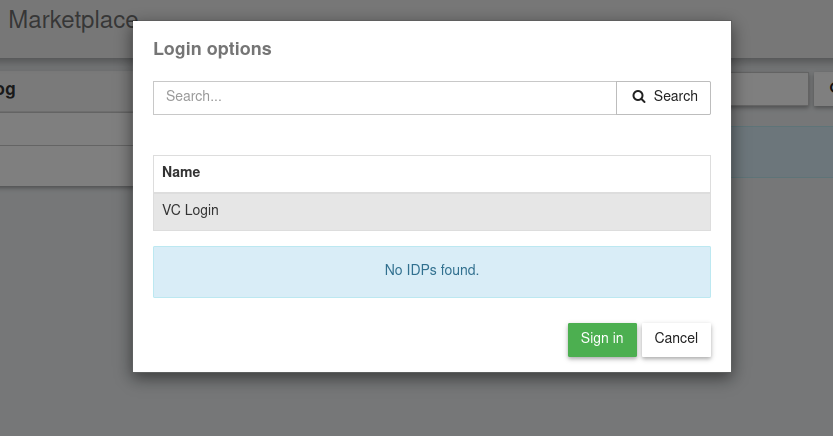
3. A QR will Pop-Up, scan it with the wallet as its already described for the [OnBoarding Portal, steps 2-4](#onboard-at-the-portal) 
4. You are know logged into the marketplace, as a representative of "Dome Fiware"(see account in the top-left corner)

### Create a catalog

Products in the DOME Market are created in "Catalogs". To create a catalog(that will be distributed through all interested Marketplace-Instances), the following steps can be used:

1. Click on "My stock":
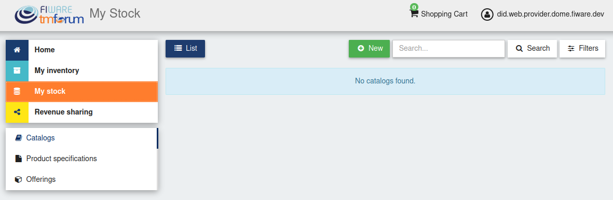
2. Click the "New" button in the middle of the screen:
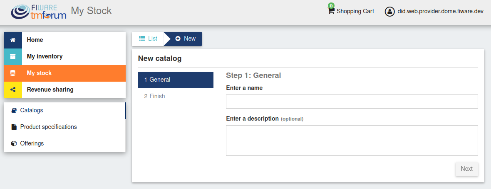
3. Enter a meaningful name, click next and finish:
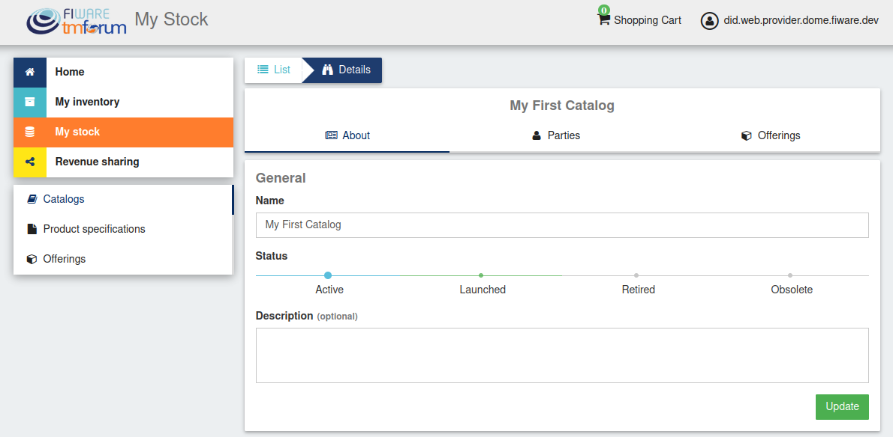
4. The catalog is now in state active and already(after a couple of seconds) distributed through the instances. To become visible for all users, it needs to be launched. Even thought we dont have any Products in it yet, we launch it for demonstrational purposes. Select the Green-Dot above "Launched" and click on "Update":
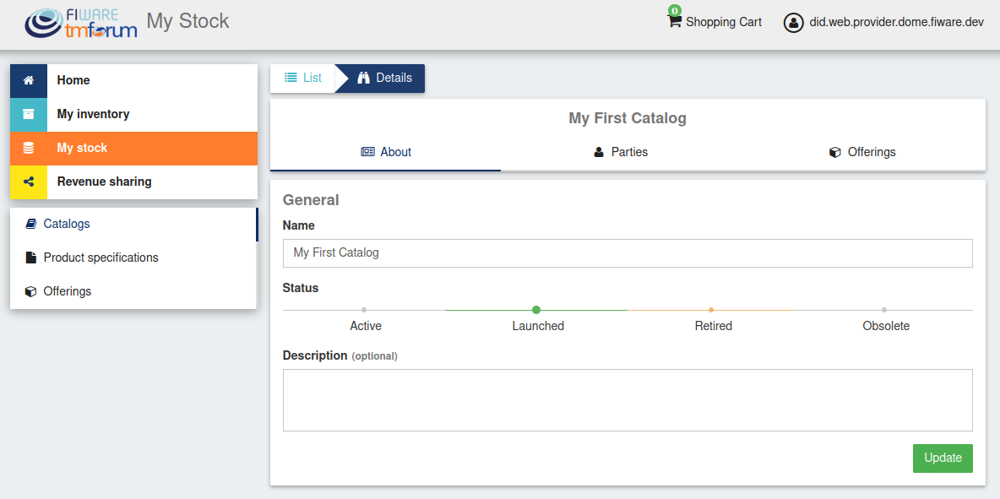
5. Since the catalog is now launched(and the state-change distributed through the AccessNodes), it can also be seen by all other marketplace users(even by once that are not logged-in). To validate it, navigate to the BAE-Instance running for the Provider in the [FIWARE Environement](https://github.com/FIWARE-Ops/fiware-gitops/tree/master/aws/dome/provider/bae) at https://marketplace-provider.dome.fiware.dev and see the new Catalog at the left side:
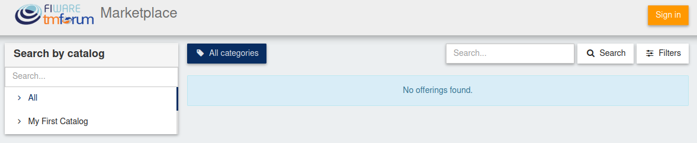